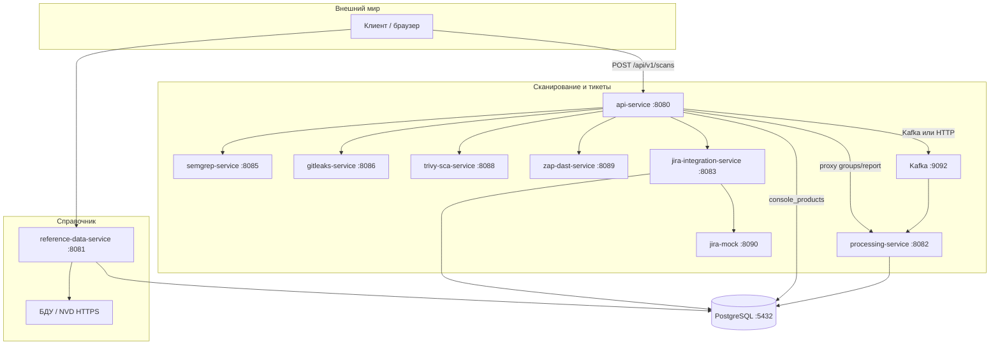

# Архитектура `mephi_vkr_asoc`

Микросервисная система сбора результатов сканирования, нормализации находок, корреляции со справочниками CVE/БДУ и выгрузки в Jira. Локальный стенд: `deploy/compose.yaml`. Манифесты Kubernetes: `deploy/k8s/`. Веб-клиент: `mephi_vkr_asoc_front` (React + Vite).

---

## Обзор

Система принимает результаты **SAST** (Semgrep, Gitleaks), **SCA** (Trivy), **DAST** (OWASP ZAP), нормализует их в единый формат, сопоставляет со справочниками **NVD/CVE** и **БДУ ФСТЭК**, группирует уязвимости и создаёт задачи в Jira.

---

## Микросервисы

| Сервис | Назначение |
|--------|------------|
| **api-service** | Внешний HTTP API: запуск сканов, каталог интеграций, продукты консоли, группы/отчёт, проксирование в processing и Jira. |
| **semgrep-service** | SAST по файлам внутри контейнера (`POST /api/v1/scan`). |
| **gitleaks-service** | Поиск секретов в репозитории/каталоге. |
| **trivy-sca-service** | SCA: `trivy fs` по каталогу или после shallow clone. |
| **zap-dast-service** | DAST: OWASP ZAP baseline по `target_url`. |
| **reference-data-service** | Синхронизация NVD и БДУ ФСТЭК в PostgreSQL. Общается с processing только через БД. |
| **processing-service** | Ingest находок (Kafka или HTTP), нормализация, корреляция по CVE/CWE, группировка. |
| **jira-integration-service** | Создание задач в Jira, идемпотентные связи `group_id` ↔ тикет. |
| **jira-mock** | Заглушка Jira для локального стенда. |

Инфраструктура: **PostgreSQL** (одна БД, несколько схем), **Kafka** (при заданном `APP_KAFKA_BROKERS`).

---

## Потоки

Два независимых направления:
- **Справочники:** `reference-data-service` → БД (NVD, БДУ).
- **Сканирование → тикеты:** клиент → `api-service` → executor → findings-adapter → **Kafka** (`asoc.findings.ingest`) или HTTP → `processing-service` → БД → `jira-integration-service`.

---

## Kafka

При заданном `APP_KAFKA_BROKERS` используется паттерн request-reply через два топика:

| Топик | Роль |
|-------|------|
| `asoc.findings.ingest` | Пакет находок от `api-service` (с `correlation_id`). |
| `asoc.findings.ingest.result` | Ответ `processing-service` (тот же `correlation_id`). |

Без брокера `api-service` шлёт тот же JSON по HTTP `POST /api/v1/findings/ingest` на `processing-service` (HTTP ingest по умолчанию включён, когда Kafka не задана).

Топики создаются при старте `api-service` и `processing-service` (1 партиция, RF=1).

---

## Сквозной сценарий

1. Клиент вызывает `POST /api/v1/scans` с `scanner_id` (`semgrep`, `gitleaks`, `trivy-sca`, `zap-dast`).
2. `api-service` вызывает executor, тот возвращает сырой отчёт; `findings-adapter-service` нормализует его в `[]ProcessingFindingItem`.
3. Пакет уходит в `processing-service` через Kafka или HTTP.
4. `processing-service` пишет находки, сопоставляет с `catalog.*`, выполняет группировку.
5. `api-service` запрашивает группы у `processing-service`, затем создаёт тикеты через `jira-integration-service`.

---

## Синхронизация справочников

- По расписанию раз в 24h (первый запуск с задержкой 1m): `APP_SYNC_SCHEDULER_ENABLED`, `APP_SYNC_INITIAL_DELAY`, `APP_SYNC_INTERVAL`.
- Ручной запуск через REST `reference-data-service` (`/api/v1/sync/...`).

---

## Порты (локально)

| Сервис | Порт |
|--------|------|
| api-service | 8080 |
| reference-data-service | 8081 |
| processing-service | 8082 |
| jira-integration-service | 8083 |
| semgrep-service | 8085 |
| gitleaks-service | 8086 |
| trivy-sca-service | 8088 |
| zap-dast-service | 8089 |
| jira-mock | 8090 |
| Kafka | 9092 |

Переменные окружения: `docs/ENVIRONMENT.md`. Таблицы БД: `docs/SERVICES_AND_DATA.md` и `docs/DATABASE.md`.
