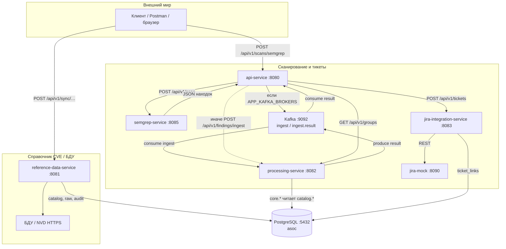
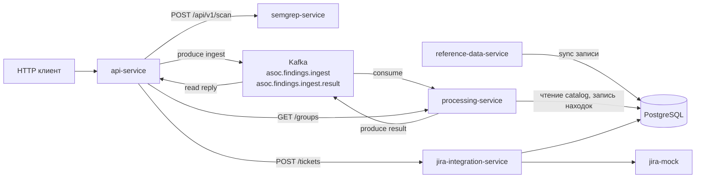
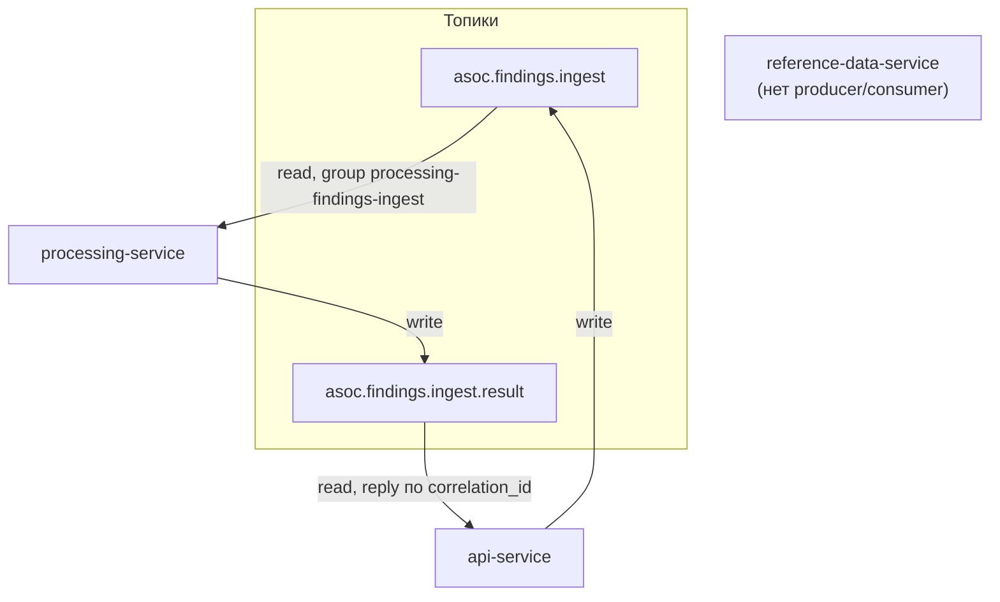

# Архитектура `mephi_vkr_asoc`

Документ описывает **реализованный в репозитории** контур: микросервисы, обмен по HTTP и Kafka, общую PostgreSQL и типовой сценарий «сканирование → обработка находок → корреляция со справочником → группы → тикет в Jira». Поднять стенд: `deploy/docker-compose.yml`, пошагово — `demo/DEMO.md`. Развёртывание в **Kubernetes**: `deploy/k8s` (Kustomize, Postgres + Kafka + те же сервисы; **api-service** с опциональным ключом `APP_AUTH_API_KEY`, см. `deploy/k8s/README.md`). Исходники диаграмм (Mermaid): `docs/diagrams/` (`system_overview.mmd`, `kafka_app_flow.mmd`, `kafka_read_write.mmd`).

**Веб-клиент:** отдельный репозиторий **`mephi_vkr_asoc_front`** (React, TypeScript, Vite) — браузерный UI поверх тех же REST API: дашборд, запуск Semgrep, экран групп, ручной синхрон справочников. HTTP-запросы идут на относительные пути `/api/v1/...`; в dev **прокси Vite** (`vite.config.ts` в том репозитории) перенаправляет их на сервисы на localhost (`8080` — api и сканы, `8081` — sync, `8082`/`8083` — группы и тикеты). Запуск: см. README в `mephi_vkr_asoc_front`. В **`docker-compose`** здесь поднимается только backend; UI — отдельно. Альтернатива — **`curl`/Postman** (`demo/DEMO.md`) и просмотр таблиц в **PostgreSQL**.

---

## Обзор

Система собирает результаты статического анализа (Semgrep), нормализует находки, сопоставляет их со справочниками **NVD/CVE** и **БДУ ФСТЭК** (данные лежат в БД), группирует уязвимости и создаёт задачи в Jira (на локальном стенде — через `jira-mock`). Для пользовательского сценария основная точка входа по HTTP — **`api-service`** (браузерный клиент в **`mephi_vkr_asoc_front`** или REST-клиент); остальные сервисы вызываются из него или работают по расписанию/из Kafka.

---

## Микросервисы: роли

| Сервис | Назначение |
|--------|------------|
| **api-service** | Внешний HTTP API для демо-сценария (вызывается из веб-клиента **`mephi_vkr_asoc_front`** и из `curl`/Postman): запуск Semgrep, передача находок в processing (HTTP или Kafka), чтение групп, вызов создания тикета. В БД **не пишет**. |
| **semgrep-service** | HTTP-обёртка над Semgrep: запуск анализа по путям к **файлам внутри своего контейнера** (`POST /api/v1/scan`). |
| **reference-data-service** | Периодический и ручной синхрон справочников NVD и БДУ ФСТЭК в PostgreSQL (`catalog.*`, `raw.*`, `audit.*`). С **processing** по HTTP **не общается** — только через общие таблицы. |
| **processing-service** | Ingest находок (HTTP и/или Kafka), нормализация, корреляция по CVE/CWE через SQL к `catalog.*`, группировка, запись в `core.*`. |
| **jira-integration-service** | Создание задач в Jira REST, идемпотентные связи `group_id` ↔ тикет в `integration.ticket_links`. |
| **jira-mock** | Упрощённая имитация Jira для локального контура. |

Инфраструктура: **PostgreSQL** (одна БД, несколько схем), **Kafka** (брокер в compose; см. ниже).

---

## Взаимодействие и потоки (логика)

1. **Справочники** наполняются **независимо** от сканирования: `reference-data-service` пишет в БД; `processing-service` только **читает** `catalog.*` при корреляции.
2. **Корреляция не через HTTP между справочником и обработкой**: оба сервиса смотрят в **одну БД**, чтобы не дублировать REST-контракт справочника и снизить связность.
3. **Сквозной пользовательский сценарий** всегда идёт через **api-service** (клиент не ходит напрямую в processing/jira, если не отлаживает сервисы по отдельности).

### Общая схема контуров

Сводка: два независимых направления — **справочники** (HTTPS → `reference-data-service` → БД) и **сканирование → обработка → тикеты** (через `api-service`; ingest в processing — по Kafka или напрямую по HTTP). Исходник: `diagrams/system_overview.mmd`.

### Упрощённый поток Kafka (ingest находок)

Исходник `diagrams/kafka_app_flow.mmd`:

### Топики Kafka: producer / consumer

Исходник `diagrams/kafka_read_write.mmd`:

---

## Kafka: зачем и как устроено

При ненулевом **`APP_KAFKA_BROKERS`** (в compose — `kafka:9092`):

| Топик | Роль |
|-------|------|
| **`asoc.findings.ingest`** | Пакет находок от `api-service`: в теле есть `correlation_id` и JSON ingest. |
| **`asoc.findings.ingest.result`** | Ответ `processing-service`: тот же `correlation_id` и результат пайплайна (или ошибка). |

**Паттерн:** request-reply через два топика с одной партицией на топик: `api-service` **публикует** ingest и **ждёт** сообщение в `ingest.result` с тем же `correlation_id`; `processing-service` **потребляет** ingest (consumer group `processing-findings-ingest`), выполняет тот же код, что и HTTP `POST /api/v1/findings/ingest`, и **публикует** результат.

**Прямой HTTP** `POST /api/v1/findings/ingest` на `processing-service` **сохранён** для ручных тестов и для режима без брокера.

Если **`APP_KAFKA_BROKERS` пустой**, `api-service` отправляет находки **только по HTTP** на `processing-service`.

**Справочники:** `reference-data-service` подключает Kafka в конфиге, но публикация событий синка — **заглушка (noop, лог)**; на обмен находками это не влияет.

Топики создаются при старте `api-service` и `processing-service` (`EnsureTopics`, 1 партиция, RF=1).

---

## Основной сценарий (end-to-end)

1. Клиент вызывает `POST /api/v1/scans/semgrep` на `api-service` (цель и правила можно опустить — подставятся **`APP_DEFAULT_SCAN_TARGET_PATH`** и **`APP_DEFAULT_SEMGREP_CONFIG`** из compose).
2. `api-service` вызывает `POST /api/v1/scan` на `semgrep-service`, получает JSON находок.
3. `api-service` передаёт ingest в **`processing-service`**: при Kafka — через топики **`asoc.findings.ingest` → `asoc.findings.ingest.result`**, иначе — **`POST /api/v1/findings/ingest`**.
4. `processing-service` пишет находки и уязвимости, **читает `catalog.*` в PostgreSQL** для сопоставления по CVE/CWE, выполняет группировку.
5. `api-service` запрашивает `GET /api/v1/groups` у `processing-service`, затем `POST /api/v1/tickets` у `jira-integration-service`.
6. `jira-integration-service` обращается к Jira (на стенде — `jira-mock`), сохраняет связь в `integration.ticket_links`.

Шаги 1–2 и 4–6 — синхронный HTTP; шаг 3 при включённом Kafka — **очередь + ответ в топике** (HTTP-запрос к `api-service` для клиента остаётся блокирующим до результата ingest). Очередь между processing и Jira **не используется**.

---

## Semgrep: что сканируется

Semgrep установлен в образе **`semgrep-service`**. Путь к коду — **внутри этого контейнера**; на хосте каталоги монтируются в `/app/demo/...`. Подробности целей: `demo/scan-targets/README.md`.

---

## Синхронизация справочников

- По расписанию (по умолчанию раз в **24h**, первый запуск с задержкой **1m**): `APP_SYNC_SCHEDULER_ENABLED`, `APP_SYNC_INITIAL_DELAY`, `APP_SYNC_INTERVAL`.
- Ручной запуск через REST `reference-data-service` (`/api/v1/sync/...`).
- После успешного синка вызывается noop-публикация в Kafka (место под будущие события).

---

## Порты (`docker-compose`)

| Сервис | Порт |
|--------|------|
| api-service | 8080 |
| reference-data-service | 8081 |
| processing-service | 8082 |
| jira-integration-service | 8083 |
| semgrep-service | 8085 |
| jira-mock | 8090 |
| Kafka | 9092 |

Переменные окружения: **`docs/ENVIRONMENT.md`**. Таблицы БД и матрица «кто куда пишет»: **`docs/SERVICES_AND_DATA.md`** и **`docs/DATABASE.md`**.

---

## Дальнейшее развитие (идеи, не текущий scope)

- Расширение веб-клиента (`mephi_vkr_asoc_front`): новые экраны, роли пользователей, углублённая работа с находками и отчётами.
- Публичная спецификация API (OpenAPI/Swagger) для `api-service`.
- Аутентификация и разграничение доступа к внешнему API.
- Расширение Kafka: события синхронизации справочников, групп, тикетов вместо noop; при необходимости — полностью асинхронный API без reply-топика.
